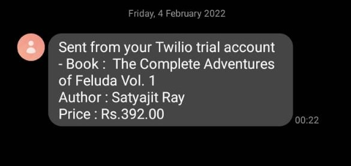
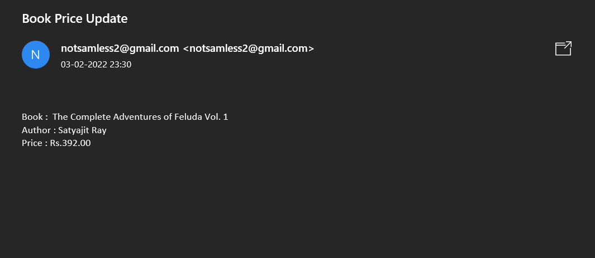
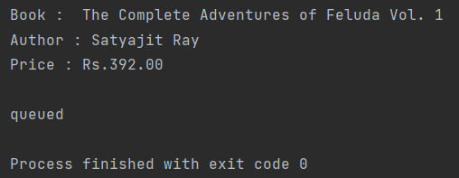

# BOOK PRICE CHECKER 

## About 
It is a program that checks the price of the book in amazon(pre-selected) and mails/texts 
the details to the user. 
 
## Output 
1. Text Message

2. Mail 

3. Print

## How to use
1. Copy the url of the amazon book you want to check and paste it
inside the a_scrape.py , self.url file.
<code> self.url =  'BOOK_URL' </code>
2. Add your own Twillio Api url and token inside the messaging.py file. 
<code>self.account_sid = os.getenv('api')</code>   
<code> self.auth_token = os.getenv('token')</code>
3. Add you email id in messaging.py inside the email function   
<code>sender = os.getenv('remail')</code>    
<code> myemail, mypassword = os.getenv('semail'),os.getenv('spw')</code>

### Modules  
1. _BeautifulSoup_ 
2. _requests_ 
3. _smtplib_
4. _os_ 
5. _dotenv_

### API 
1. _Twillio(for messaging)_

